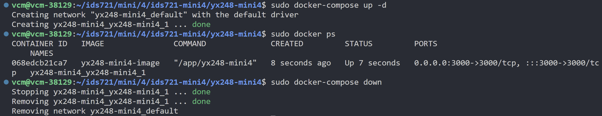

# ids721-mini4

## Create a Cargo Function Microservice Project

1. Install Rust and Cargo
Rust is a programming language that Cargo, its package manager, uses. To install Rust and Cargo on Ubuntu, open your terminal and run the following command:

```bash
curl --proto '=https' --tlsv1.2 -sSf https://sh.rustup.rs | sh
```

This will download a script and start the installation. You'll need to follow the on-screen instructions.

2. Configure the Current Shell
After installation, configure your current shell by running:

```bash
source $HOME/.cargo/env
```

3. Create a New Cargo Project
To create a new Cargo project, use the cargo new command. For a microservice, you might want to start with a simple binary project:

```bash
cargo new yx248-mini4 --bin
```

This command creates a new directory named my_microservice with the basic structure of a Rust project.

4. Add Dependencies
Edit the `Cargo.toml` file to add necessary dependencies. For a microservice, you might use frameworks like Actix-web, Rocket, or Warp. Here's an example using Actix-web:

```toml
axum = "0.7.4"
tokio = { version = "1.36.0", features = ["macros", "full"] }
tower = "0.4.13"
# s3
rusoto_core = "0.47.0"
rusoto_s3 = "0.47.0"
csv = "1.1"
# json
serde_json = "1.0.113"
serde = { version = "1.0.196", features = ["derive"] }
# openssl
openssl = { version = "0.10", features = ["vendored"] }
```

Always check for the latest version of these libraries.


## Add Your Own Functions for Microservice

1. Create a new file named `lib.rs` to hold your data processing functions and tests.

2. Modify your `main.rs` to fit your function requirements and your router structure.

- For my function, it is based on my mini-project2 function:
[yx248-mini2 Link](https://gitlab.com/dukeaiml/IDS721/yx248-mini2)


## Build and Run the Project Local

Navigate to your project directory in the terminal and run the project with Cargo:

```bash
cargo run
```

Your microservice should now be running on localhost at the specified port (e.g., 127.0.0.1:3000).


## Local Testing
Test your microservice by navigating to the address in a web browser or using tools like `curl`:

```bash
curl http://127.0.0.1:8080/
```


## Build Docker Container

- To build and run the Docker container without environment variables (e.g., for testing or development environments), use the following commands:

```bash
# Build the Docker image
sudo docker build -t yx248-mini4-image .

# Run the container in detached mode (background) mapping port 3000
sudo docker run -dp 3000:3000 yx248-mini4-image

# List running containers to find the container ID
sudo docker ps

# Stop the running container using its ID
sudo docker stop <container_id>

# Remove the stopped container by its ID
sudo docker rm <container_id>
```

Replace <container_id> with the actual ID of your Docker container, which you can find using sudo docker ps.

- If you need to include sensitive information or environment-specific variables (like AWS credentials) in your build, it's recommended to use a `docker-compose.yml` file along with a `.env` file. This approach keeps sensitive data out of the Dockerfile and image itself:

```bash
# Build the Docker image using docker-compose
sudo docker-compose build

# Run the container in detached mode (background) using docker-compose
sudo docker-compose up -d

# List running containers to find the container ID
sudo docker ps

# To stop and remove the running container, use docker-compose
sudo docker-compose down
```

- Here are the screenshot for my docker build, up, ps, and down operations:



- Here is the screenshot for my result I got when I run my microservice:

